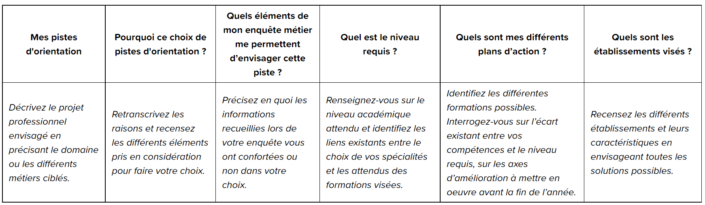

# Parcoursup

## Calendrier

## Novembre

Le premier trimestre de Terminale est le moment de définir votre projet d'orientation et d'explorer les nombreuses formations proposées sur Parcoursup.

**Novembre 2021 : préparation du projet d'orientation**

La réforme du bac a donné naissance à une épreuve particulière : le Grand oral du baccalauréat. Les 5 dernières minutes de cet oral sont consacrées à la présentation de votre projet d'orientation. Il est donc très important de le construire méthodiquement afin d'être capable de le présenter devant un jury d'examen.

Ainsi, en rencontrant des professionnels, en discutant avec vos professeurs ou en participant à des journées portes ouvertes ou des salons d'orientation, vous préparez le baccalauréat et votre inscription sur Parcoursup !

Vous ne savez pas par où commencer ? Pas de panique ! L'important est de vous poser les bonnes questions.

Définir son orientation et son projet professionnel est un travail de longue haleine. Le choix des spécialités en classe de Première a été l'occasion d'initier cette réflexion autour de votre orientation. Dès le premier trimestre de Terminale, il s'agit de préciser votre projet d'études afin qu'il soit cohérent avec vos spécialités et votre personnalité.

Dans un premier temps, l'heure est au bilan. Pour préparer votre entretien personnalisé d'orientation avec votre professeur principal, commencez par répondre à des questions générales, [par exemple - questionnaire ONISEP](https://www.lescoursduparnasse.com/media/default/0001/03/a01c1d6a76eb30743efd5905e05bfa2ae569fcf1.pdf)

- Comment avez-vous choisi vos spécialités au lycée ?
- Dans quelle discipline réussissez-vous le mieux ?
- Quelle(s) discipline(s) n'aimez vous pas ? Pourquoi ?
- L'organisation est-elle votre point fort ?
- Etes vous à l'aise à l'écrit ? à l'oral ?
- Pour vous aider à réaliser ce bilan, vous pouvez consulter et compléter le questionnaire proposé par Parcoursup.

Dans un second temps, ce travail introspectif devrait vous permettre de dégager des pistes d'orientations et un plan d'actions à entreprendre pour conforter vos choix :

## Entretien personnalisé

### Avant l'entretien

1. Préparez un document, de préférence sous forme de tableau, que vous apporterez le jour de l’entretien.
   Vous y indiquerez toutes vos démarches, vos réflexions et vos intentions d’orientation. Rédigez-le comme une
   sorte de compte rendu organisé pour faciliter la communication avec votre professeur.
2. Si vous avez des questions sur vos démarches ou des précisions à demander concernant vos recherches, ajoutez-les à votre document.
3. Prenez également du papier et un stylo pour noter les remarques et les conseils de votre professeur.
4. Si vous ne savez vraiment pas quoi faire, ne vous inquiétez pas! Votre professeur vous indiquera les démarches à suivre pour vous aider.

### Pendant l'entretien

1. Ne vous censurez pas! Votre professeur vous reçoit en tant qu’« accompagnateur » et non « évaluateur ».
   Lors de l’entretien d’orientation, votre professeur n’est pas là pour vous juger mais pour vous aider à
   construire votre projet d’orientation.
2. Essayez d’être clair et concis pour que vous ayez le temps de réfléchir ensemble aux démarches et aux
   recherches à poursuivre.
3. Prenez en note les conseils et les remarques importantes.
4. Faites un point avec votre professeur à la fin de l’entretien sur ce qui a été dit.

### Après l'entretien

1. Juste après l’entretien, reportez les idées et les conseils qui ont été évoqués lors de l’entretien.
2. Planifiez les démarches qu’il vous reste à faire et notez sur votre agenda la date du prochain rendez-vous.
