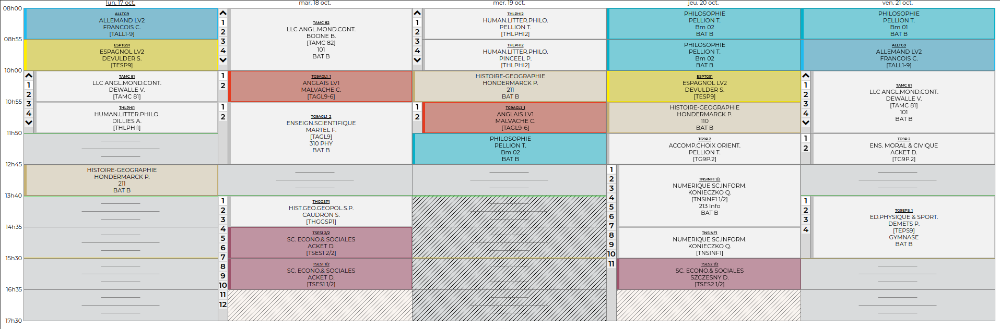
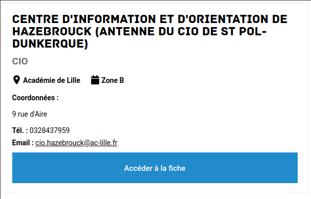

## Formalités

- listes, appel
- Professeurs principaux M. Pellion (Philosophie), M. Konieczko (Maths & NSI)
- Documents :
  - emploi du temps,
  - carnets,
  - photographie (10h30)

## Calendrier de l'orientation

2021-2022 mais ça ne devrait pas trop changer...

| Phase          | Dates            | Evénements                                          |
| -------------- | ---------------- | --------------------------------------------------- |
| information    | 21 Déc           | Ouverture de Parcoursup                             |
| inscription    | 20 Jan- 29 mar   | Saisie des voeux                                    |
| inscription    | 30 Mar - 7 avr   | Finalisation du dossier et confirmation des voeux   |
| principale     | 2 Juin - 15 Juil | Réponse des établissements                          |
| complémentaire | 23 Juin - 16 Sep | Saisie de nouveaux voeux et proposition d'admission |

[Compléments](https://www.lescoursduparnasse.com/calendrier-parcoursup)

## Enjeux et prise de recul

Avec la réforme du bac les DS et bacs blancs importent davantage. L'avis du Conseil de classe est déterminant pour l'admission post bac. Il sera bon de prendre un peu de recul et d'organiser correctement son travail personnel afin d'éviter les désillusions.

## Le conseil de classe : on ne rigole plus !

Le conseil de classe prononce un avis global qui figure dans parcours sup. C'est aussi là qu'on commentera les souhaits d'orientation. Autant de moments déterminants pour l'orientation post bac.

# Épreuves et coefficients

Les disciplines du tronc commun n'ont généralement pas d'épreuve terminale.

## Coefficients

| Matière                   | Première | Terminale | Total |
| ------------------------- | -------- | --------- | ----- |
| Histoire-géographie       | 3        | 3         | 6     |
| Enseignement scientifique | 3        | 3         | 6     |
| LVA                       | 3        | 3         | 6     |
| LVB                       | 3        | 3         | 6     |
| EPS                       | -        | 6         | 6     |
| EMC                       | 1        | 1         | 2     |
| Spécialité 1              | 8        | -         | 8     |
| Total                     |          |           | 40    |

## Options facultatives

| Matière  | Première | Terminale | Total |
| -------- | -------- | --------- | ----- |
| Option 1 | 2        | 2         | 4     |
| Option 2 | 2        | 2         | 4     |
| Total    |          |           | 8     |

## Épreuves terminales

| ÉPREUVES    | NATURES  | DURÉES   | COEF. | DATE    |
| ----------- | -------- | -------- | ----- | ------- |
| Français    | Écrit    | 4h       | 5     | Juin 22 |
|             | Oral     | 20mn     | 5     | Juin 22 |
| Spécialités | variable | variable | 16    | Mars 23 |
| Philosophie | Écrit    | 4h       | 8     | Juin 23 |
| Grand oral  | Oral     | 20mn     | 10    | Juin 23 |

# Emploi du temps

- Semaine bien remplie !
- Lundi et mercredi après-midi libres pour tout le monde
- Beaucoup de spécialités différentes
- 1h d'accompagnement à l'orientation le jeudi ou le vendredi en quinzaine et en demi groupe

# Orientation

## Projet

Il convient, afin d'éviter les difficultés l'an prochain, de préparer sérieusement les choix d'orientation. Vos positions actuelles évolueront durant l'année et vous devez conserver une grande ouverture d'esprit.
Vos résultats auront une influence certaine sur vos voeux, il serait dommage de se priver d'un parcours intéressant par manque d'investissement.

##

Certains établissements ne sont pas référencés sur Parcoursup et vous pourriez être tentés de négliger celui-ci. Il convient de garder à l'esprit que :

- ces établissements sont généralement sélectifs ou payants. Vous ne serez peut-être pas pris.
- le taux de réorientation en début de parcours dans le supérieur est élevé, il convient de se garder des portes de sortie en cas de déception.

## Accompagnement à l'orientation

1h en quinzaine et en demi-groupe.

- Le jeudi pour le groupe 2 avec M. Pellion,
- Le vendredi pour le groupe 1 avec M. Konieczko

## Classroom pour le groupe 1

- [Classroom](https://classroom.google.com/c/NTQ0MzY3NzIwODE3)

## Ressources

- [Terminale 21 22](https://www.terminales2021-2022.fr/)

- 

##

[CIO d'Hazebrouck](https://www1.ac-lille.fr/centre-d-information-et-d-orientation-site-d-hazebrouck-121510)

- Code RNE : 0590292x
- Adresse : 9, rue d'Aire - 59190 HAZEBROUCK
- Tél. : 03.28.43.79.59
- email : cio.hazebrouck@ac-lille.fr

- Directrice : Madame O. BOUTELIER

- Padlet du CIO de Dunkerque-Flandres : ressources d'informations et liens utiles pour les usagers

- Permanences d'accueil

  _Période scolaire_ :
  Du lundi au vendredi : de 8h30 à 12h et de 13h30 à 17h30
  Le samedi : de 9h à 12h

  _Hors période scolaire_
  Du lundi au vendredi : de 9h à 12h et de 13h30 à 16h30
  Fermé le samedi

##

- [Brochure ParcourSup en trois étapes](./ressources/Brochure_Parcoursup_2022_en_3_etapes.pdf)
- [Diaporama ParcourSup en trois étapes](./ressources/Diaporama_Parcoursup-2022_en_3_etapes.pptx)
